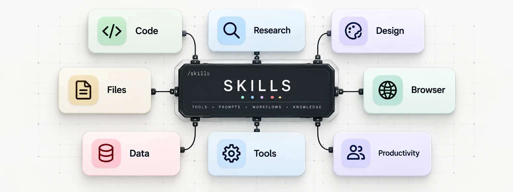

<p align="center">
  
</p>

# Skills

Reusable agent skills for Claude Code, Cursor, Codex, and other agents that support [Agent Skills](https://agentskills.io).

## Skills

| Skill | Description |
| --- | --- |
| [expo-cloudflare](skills/expo-cloudflare) | Bun + Turborepo monorepo: Expo app + TanStack Start web, Hono API on Cloudflare Workers, D1 + Drizzle, better-auth, EAS updates |

## Install

Any agent:

```bash
npx skills add mxvsh/skills                          # pick interactively
npx skills add mxvsh/skills -s expo-cloudflare -g    # one skill, globally
```

Claude Code plugin:

```
/plugin marketplace add mxvsh/skills
/plugin install app-builders@mxvsh-skills
```
